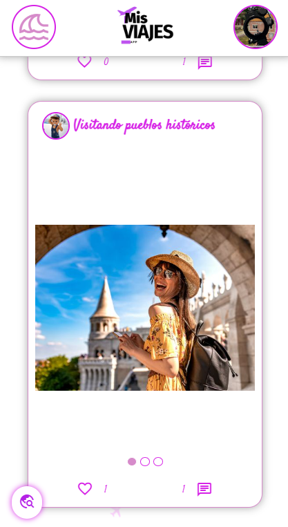
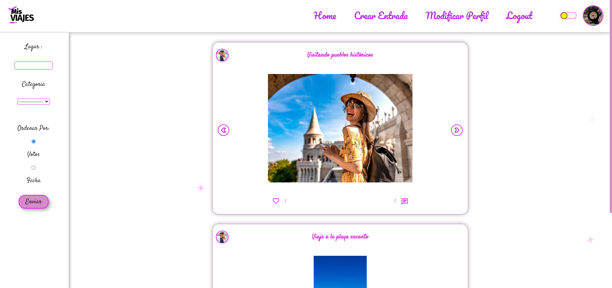
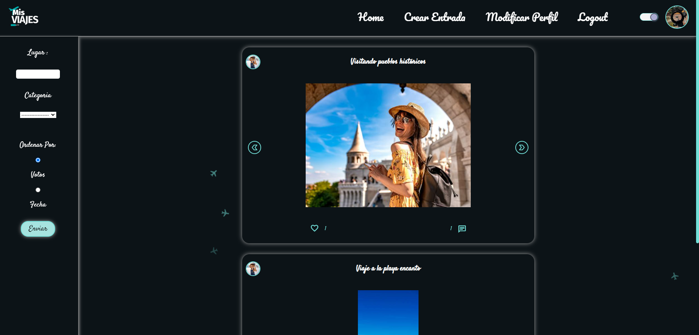

# Mis Viajes 🌍✈️

Bienvenido a Mis Viajes, tu portal para descubrir recomendaciones de viaje poco conocidas y experiencias auténticas compartidas por viajeros como tú. ¿Listo para explorar el mundo?

## 🗺️ Acerca de Mis Viajes

Mis Viajes es una plataforma tipo red social diseñada para que los amantes de los viajes compartan sus consejos y lugares secretos. Ya seas un viajero experimentado o estés planeando tu primera aventura, aquí encontrarás inspiración y consejos auténticos de la comunidad de viajeros.

## ✨ Características Destacadas

### Para Usuarios Anónimos

- 🔍 Buscar recomendaciones por lugar y categoría.
- 👍 Ordenar resultados de búsqueda por votos.
- 📖 Ver detalles de una recomendación.
- 🔐 Iniciar sesión (con email y contraseña).
- 📝 Registro de usuarios (nombre, email, contraseña y foto de perfil).

### Para Usuarios Registrados

- ✍️ Publicar recomendaciones (título, categoría, lugar, fecha, texto y fotos).
- 🗳️ Votar las recomendaciones de otros usuarios.
- 💬 Comentar publicaciones de otros usuarios.
- 🖼️ Gestión del perfil (incluye foto de perfil).
- 🗑️ Borrar tus propias recomendaciones.

## 🚀 Cómo Empezar

1. Clona este repositorio: `git clone https://github.com/TuUsuario/Mis-Viajes.git`
2. Instala las dependencias: `npm install`
3. Ejecuta la aplicación: `npm run dev`

## 🌐 API y Endpoints

Puedes encontrar más detalles sobre la API y los endpoints en [GitHub - API de Mis Viajes](https://github.com/Raquel1974/recomendacionesViajes).

## 📸 Capturas de Pantalla

## 📝 Contribución

- [David Grilo](https://github.com/griloxx)
- [Raquel Montenegro](https://github.com/Raquel1974)
- [Oscar Ramírez](https://github.com/SoyOscarRamirez)
- [Raúl Lara](https://github.com/rakalito)

## 📞 Contacto

Si tienes alguna pregunta o comentario, no dudes en ponerte en contacto con nosotros en:

- [David Grilo](https://www.linkedin.com/in/davidgrilo/)
- [Raquel Montenegro](https://www.linkedin.com/in/raquel-montenegro-moreno/)
- [Oscar Ramírez](https://www.linkedin.com/in/oscar-ram%C3%ADrez-espejo/)
- [Raúl Lara](https://www.linkedin.com/in/ra%C3%BAl-lara-g%C3%B3mez-5b2832280/)

¡Esperamos que disfrutes de tu viaje con Mis Viajes!

---
Hecho con ❤️ por el equipo de Mis Viajes
